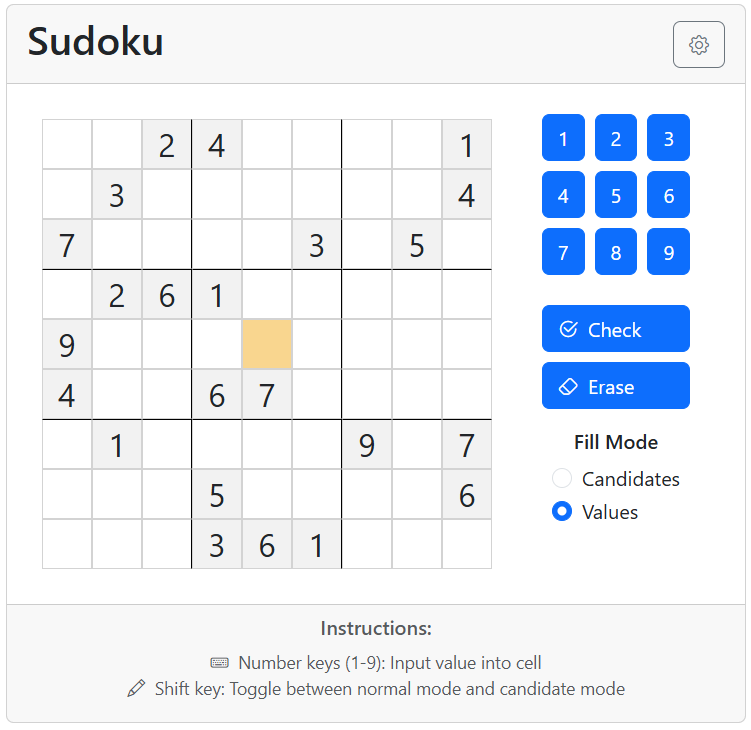

# React Sudoku

A modern Sudoku implementation built with React and Bootstrap. Play it here: [React Sudoku](https://justan-kj.github.io/sudoku-app/)

## Features

- Interactive Sudoku grid with visual feedback
- Two input modes:
  - Normal mode for entering final values
  - Candidate mode for noting possible values
- Smart cell highlighting:
  - Selected cell
  - Related cells (same value)
  - Error detection
- Full keyboard support:
  - Number keys (1-9) for input
  - Shift key to toggle between normal/candidate mode
- Responsive design with adjustable grid size

## How to Play

1. Click any cell to select it
2. Use number keys 1-9 to input values
3. Hold Shift to toggle between normal and candidate mode
4. Use the eraser button or input 0 to clear a cell
5. Click the check button to verify your solution
6. Adjust grid size using the settings gear icon

## Development

This project was built with:

- React
- React Bootstrap
- Bootstrap Icons
